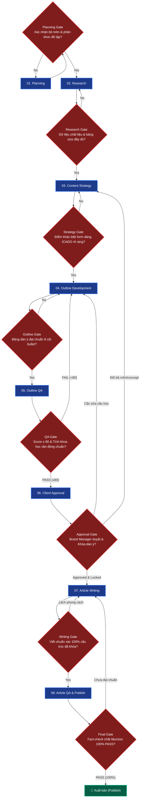

# ICADO — Full D2C Sportswear Content Workflow Pipeline

Workflow sản xuất nội dung chuyên sâu cho **ICADO — Thời Trang Thể Thao & Đồ Tập Gym / Yoga Cao Cấp** (icado.vn) chuẩn hóa theo kiến trúc FigJam 3 Cấp độ (3-Level Architecture) kết hợp Cổng kiểm soát chất lượng (Gates & Feedback Loops).

**Lệnh kích hoạt:** `/flow-ICADO-seo [keyword chính] [keyword phụ 1] [keyword phụ 2] ...`

---

## 1. LEVEL 1: HIGH-LEVEL WORKFLOW (WHAT) — 8 ĐẦU VIỆC LỚN

Sơ đồ luồng tổng thể 8 Workstreams và đầu ra tương ứng:

---

## 2. GATES & FEEDBACK LOOPS (CỔNG KIỂM SOÁT CHẤT LƯỢNG)

---

## 3. LEVEL 2: LOW-LEVEL WORKFLOW (HOW) — CHI TIẾT TỪNG ĐẦU VIỆC

### 01. PLANNING
*   **1.1 Xác định dòng đồ tập**: Đồ tập Gym (quần legging, áo bra, áo tanktop nam/nữ), Đồ tập Yoga/Pilates liền thân, Quần áo chạy bộ cản gió/thoát mồ hôi, Trang phục Athleisure dạo phố.
*   **1.2 Xác định đối tượng**: Tín đồ tập thể hình, huấn luyện viên Gym/Yoga, phụ nữ yêu thích vóc dáng khỏe khoắn, người chạy bộ.
*   **1.3 Output**: Lưu `Planning context` trong `research.md` tại `clients/General-B2B/brands/ICADO/keywords/[keyword-slug]/`.

### 02. RESEARCH
*   **2.1 Search Intent**: So sánh chất liệu đồ tập (Nylon Spandex vs Poly Spandex), cách chọn size đồ tập ôm sát không ngấn mỡ, cách phối đồ đi tập đẹp, cách giặt giữ form.
*   **2.2 Keyword Expansion**: Trích xuất bộ từ khóa công năng (co giãn 4 chiều, cạp cao giấu bụng, nâng mông quả đào, chống lộ viền tam giác).
*   **2.3 Competitor Intelligence**: Cào live DOM Top 3-5 thương hiệu đối thủ qua `browser tool`.
*   **2.4 Output**: `Keyword Strategy Table` & `Competitor Analysis Table`.

### 03. CONTENT STRATEGY
*   **3.1 Content Gap**: Khắc phục các bài viết đối thủ chỉ bán hàng thuần túy mà thiếu kiến thức về giải phẫu học cơ thể và chuyển động cơ bắp khi tập.
*   **3.2 ICADO USP**: Form dáng thiết kế riêng cho tỷ lệ người Việt, đường may flatlock chống cọ xát, công nghệ dệt định hình vóc dáng.
*   **3.3 Output**: Phần `Content strategy` trong `research.md`.

### 04. OUTLINE DEVELOPMENT
*   **4.1 Cấu trúc chuẩn 5-6 H2**:
    1. Tiêu chí lựa chọn đồ tập chuyên dụng cho từng bộ môn thể thao.
    2. Phân tích chất liệu vải dệt công nghệ cao & Bảng so sánh độ bền co giãn.
    3. Bảng chọn size đồ tập chuẩn xác theo số đo 3 vòng và cân nặng.
    4. Gợi ý phối đồ tập thể thao sành điệu & Cách bảo quản đồ tập không bai dão.
    5. ICADO — Thương hiệu đồ tập Gym/Yoga chuẩn form tôn dáng.
    6. FAQ 5 câu hỏi thường gặp.
*   **4.2 Output**: `Outline Candidate Table` trong `outline.md`.

### 05. OUTLINE QA
*   **5.1 Sportswear Ergonomics QA**: Thẩm định độ chính xác các thuật ngữ thể thao và giải pháp cơ học chuyển động.
*   **5.2 Outline Scoring**: Chấm điểm outline ($\ge 80$).
*   **5.3 Output**: `outline-qa-report.md`.

### 06. DUYỆT & KHÓA DÀN Ý (APPROVAL)
*   **6.1 Gửi Brand Team**: Trình duyệt dàn ý với nhóm quản lý nhãn hàng ICADO.
*   **6.2 Khóa outline**: Lock cấu trúc trước khi viết bài.

### 07. ARTICLE WRITING
*   **7.1 Viết bài D2C Sportswear**: Triển khai toàn văn bài viết (1500 - 1800 từ) tràn đầy cảm hứng vận động, hướng dẫn trực quan.
*   **7.2 Tạo Mục lục tự động (TOC & Anchor Links)**: Sử dụng skill `generating-table-of-contents` để tạo khối Mục Lục có liên kết Anchor (`#number_PascalCase_Underscore`) và tự động gắn thuộc tính `id="..."` vào các thẻ Heading H2/H3 tương ứng.
*   **7.3 Output**: `article.md`.

### 08. ARTICLE QA & PUBLISH
*   **8.1 Fact-check & Publish**: Kiểm tra số đo bảng size, tính hoạt động của các liên kết anchor mục lục và xuất bản bài viết lên blog ICADO.

---

## 4. LEVEL 3: EXECUTION (SKILLS, RULES & DATABASES)

### 🛠️ Skills Thực thi
1. `icado-outline-rules`
2. `generating-outlines-icado`
3. `keyword-strategy-mapping` & `keyword-expansion`
4. `competitor-outline-intelligence`
5. `generating-table-of-contents` (Tạo mục lục & gắn Anchor IDs)
6. `research-internal-links` (Nghiên cứu & chèn liên kết nội bộ)
7. `rechecking-facts` & `auditing-content`
8. `outline-quality-scoring` & `client-approval-gate`
9. `writing-semantic-content`

### 🏛️ Foundation & References
*   **Persona**: `data/reference/persona-brand/ICADO/persona-icado-skill.md`
*   **Central Entity**: `data/reference/persona-brand/ICADO/central-entity-ICADO.md`
*   **Source Context**: `data/reference/persona-brand/ICADO/source-context-ICADO.md`
