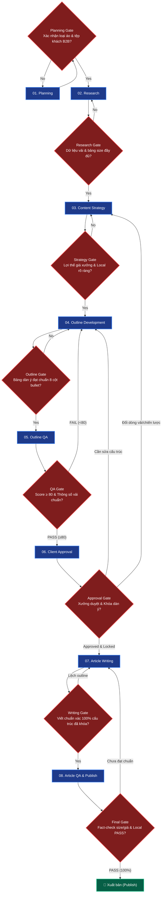

# May Mặc CTH — Full B2B Local SEO & Content Workflow Pipeline

Workflow sản xuất nội dung chuyên sâu cho **May Mặc CTH — Xưởng may đồng phục Hải Phòng** (maymaccth.com) chuẩn hóa theo kiến trúc FigJam 3 Cấp độ (3-Level Architecture) kết hợp Cổng kiểm soát chất lượng (Gates & Feedback Loops).

**Lệnh kích hoạt:** `/flow-MayMacCTH-seo [keyword chính] [keyword phụ 1] [keyword phụ 2] ...`

---

## 1. LEVEL 1: HIGH-LEVEL WORKFLOW (WHAT) — 8 ĐẦU VIỆC LỚN

Sơ đồ luồng tổng thể 8 Workstreams và đầu ra tương ứng:

---

## 2. GATES & FEEDBACK LOOPS (CỔNG KIỂM SOÁT CHẤT LƯỢNG)

---

## 3. LEVEL 2: LOW-LEVEL WORKFLOW (HOW) — CHI TIẾT TỪNG ĐẦU VIỆC

### 01. PLANNING
*   **1.1 Xác định sản phẩm**: Áo thun polo đồng phục, áo sơ mi công sở, đồ bảo hộ lao động nhà máy, đồng phục nhà hàng/spa, áo khoác gió.
*   **1.2 Xác định đối tượng**: Doanh nghiệp tại các KCN Hải Phòng (VSIP, Đình Vũ, Tràng Duệ, Nomura...), các cơ quan trường học tại miền Bắc.
*   **1.3 Output**: Lưu `Planning context` trong `research.md` tại `clients/MayMacCTH/brands/MayMacCTH/keywords/[keyword-slug]/`.

### 02. RESEARCH
*   **2.1 Search Intent**: So sánh chất liệu vải, tra cứu bảng giá may sỉ, bảng size chuẩn, cách bảo quản hình in/thêu.
*   **2.2 Keyword Expansion**: Bộ từ khóa kèm định vị địa phương (Hải Phòng, Miền Bắc, KCN) và từ khóa chất liệu (Cotton 65/35, Poly Thái, Kaki Pangrim...).
*   **2.3 Competitor Intelligence**: Cào live DOM Top 3-5 xưởng may đối thủ qua `browser tool`.
*   **2.4 Output**: `Keyword Strategy Table` & `Competitor Analysis Table`.

### 03. CONTENT STRATEGY
*   **3.1 Content Gap**: Khắc phục các bài viết đối thủ thiếu bảng thông số vải rõ ràng hoặc giấu bảng giá xưởng.
*   **3.2 Local & USP**: Định vị May Mặc CTH có xưởng sản xuất trực tiếp tại Hải Phòng, hỗ trợ gửi mẫu vải tận nơi miễn phí.
*   **3.3 Output**: Phần `Content strategy` trong `research.md`.

### 04. OUTLINE DEVELOPMENT
*   **4.1 Cấu trúc chuẩn 5-6 H2**:
    1. Tổng quan phân khúc & tiêu chuẩn sản phẩm đồng phục.
    2. Bảng so sánh chi tiết các chất liệu vải may phù hợp nhất.
    3. Bảng thông số chọn size áo chuẩn form người Việt.
    4. Bảng báo giá may tận xưởng & các yếu tố ảnh hưởng đến giá thành.
    5. Xưởng May Đồng Phục CTH — Địa chỉ may uy tín tại Hải Phòng.
    6. FAQ 5 câu hỏi thường gặp.
*   **4.2 Output**: `Outline Candidate Table` trong `outline.md`.

### 05. OUTLINE QA
*   **5.1 Fabric & Local QA**: Thẩm định tên gọi chất liệu, tỷ lệ dệt, mật độ từ khóa Local Hải Phòng.
*   **5.2 Outline Scoring**: Chấm điểm outline ($\ge 80$).
*   **5.3 Output**: `outline-qa-report.md`.

### 06. DUYỆT & KHÓA DÀN Ý (APPROVAL)
*   **6.1 Gửi xưởng**: Trình duyệt dàn ý với ban quản lý xưởng may CTH.
*   **6.2 Khóa outline**: Lock cấu trúc trước khi viết bài.

### 07. ARTICLE WRITING
*   **7.1 Viết bài B2B**: Triển khai toàn văn bài viết (1600 - 2200 từ), lồng ghép bảng biểu và hướng dẫn chọn mẫu vải trực quan.
*   **7.2 Output**: `article.md`.

### 08. ARTICLE QA & PUBLISH
*   **8.1 Fact-check & Publish**: Kiểm tra số đo bảng size, công thức báo giá may sỉ, bàn giao bài viết cho CMS May Mặc CTH.

---

## 4. LEVEL 3: EXECUTION (SKILLS, RULES & DATABASES)

### 🛠️ Skills Thực thi
1. `maymaccth-outline-rules`
2. `generating-outlines-maymaccth`
3. `keyword-strategy-mapping` & `keyword-expansion`
4. `competitor-outline-intelligence`
5. `rechecking-facts` & `auditing-content`
6. `outline-quality-scoring` & `client-approval-gate`
7. `writing-semantic-content`

### 🏛️ Foundation & References
*   **Content Rules**: `data/reference/persona-brand/MayMacCTH/content-rules.md`
*   **Central Entity**: `data/reference/persona-brand/MayMacCTH/central-entity-MayMacCTH.md`
*   **Topic Clusters**: `data/reference/persona-brand/MayMacCTH/topic-clusters.md`
*   **Internal Links**: `data/reference/persona-brand/MayMacCTH/internal-links.md`
