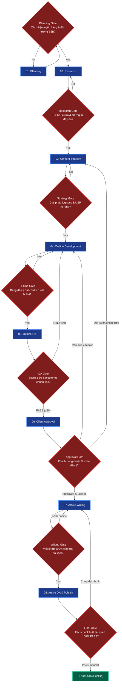

# Everest Logistics — Full B2B SEO & Content Workflow Pipeline

Workflow sản xuất nội dung chuyên sâu cho **Everest Logistics** (everestlogs.com) chuẩn hóa theo kiến trúc FigJam 3 Cấp độ (3-Level Architecture) kết hợp Cổng kiểm soát chất lượng (Gates & Feedback Loops).

**Lệnh kích hoạt:** `/flow-everest-seo [keyword chính] [keyword phụ 1] [keyword phụ 2] ...`

---

## 1. LEVEL 1: HIGH-LEVEL WORKFLOW (WHAT) — 8 ĐẦU VIỆC LỚN

Sơ đồ luồng tổng thể 8 Workstreams và đầu ra tương ứng:


---

## 2. GATES & FEEDBACK LOOPS (CỔNG KIỂM SOÁT CHẤT LƯỢNG)



---

## 3. LEVEL 2: LOW-LEVEL WORKFLOW (HOW) — CHI TIẾT TỪNG ĐẦU VIỆC

### 01. PLANNING
*   **1.1 Thu thập brief**: Xác định keyword, tuyến vận chuyển (vd: Hải Phòng - Cát Lái, Việt Nam - Mỹ/Trung Quốc), mặt hàng (hàng thường, nguy hiểm, đông lạnh).
*   **1.2 Xác định mục tiêu**: Thu hút lead B2B cho dịch vụ cước tàu biển (FCL/LCL), cước bay (Air) hoặc khai báo hải quan.
*   **1.3 Xác định đối tượng**: Giám đốc Supply Chain, Trưởng phòng Xuất Nhập Khẩu, Chuyên viên Logistics.
*   **1.4 Rà soát dịch vụ Everest**: Đối chiếu với dịch vụ thực tế của Everest Logistics.
*   **1.5 Phạm vi & ràng buộc**: Tuân thủ luật hải quan, Incoterms 2020, không hứa hẹn thời gian thông quan tuyệt đối phi thực tế.
*   **1.6 Output**: Lưu `Planning context` trong `research.md` tại `clients/Everest-Logistics/brands/Everest-Logistics/keywords/[keyword-slug]/`.

### 02. RESEARCH
*   **2.1 Search Intent**: Nhận diện intent B2B (Tra cước, thủ tục, quy định mã HS, thuế nhập khẩu, thời gian vận chuyển).
*   **2.2 Keyword Expansion**: Trích xuất bộ từ khóa kỹ thuật logistics, phụ phí (THC, CIC, D/O, BAF).
*   **2.3 Semantic & Entity Research**: Phân tích thực thể cảng biển (POD, POL), hãng tàu, loại container, tờ khai hải quan.
*   **2.4 Competitor Intelligence**: Cào live DOM Top 3-5 đối thủ logistics qua `browser tool`.
*   **2.5 Output**: `Keyword Strategy Table` & `Competitor Analysis Table`.

### 03. CONTENT STRATEGY
*   **3.1 Content Gap**: Tìm các khâu thủ tục hay bị vướng mắc/phí ẩn mà đối thủ chưa giải thích rõ.
*   **3.2 Service Matching**: Ghép đúng dịch vụ Everest (FCL/LCL, Air Freight, Khai thuê hải quan, Kho bãi).
*   **3.3 B2B Angle**: Nhấn mạnh độ an toàn, hạn chế tối đa rủi ro chậm trễ tàu và tối ưu chi phí demurrage/detention.
*   **3.4 Output**: Phần `Content strategy` trong `research.md`.

### 04. OUTLINE DEVELOPMENT
*   **4.1 Information Architecture**: Cấu trúc 5-6 H2 logic từ tổng quan tuyến hàng $\rightarrow$ bảng giá/phí $\rightarrow$ quy trình thủ tục $\rightarrow$ lưu ý chứng từ.
*   **4.2 H2 Lead Generation**: Tạo H2 dịch vụ Everest Logistics (Năng lực vận hành, quy trình báo giá, ưu đãi B2B).
*   **4.3 FAQ Research**: Chọn 5 câu hỏi thường gặp nhất về thủ tục và cước.
*   **4.4 Bảng biểu**: Trình bày bảng so sánh cước, checklist chứng từ hồ sơ.
*   **4.5 Chữ ký**: Chèn chữ ký chuẩn của Everest Logistics.
*   **4.6 Output**: `Outline Candidate Table` trong `outline.md`.

### 05. OUTLINE QA
*   **5.1 Logistics Logic QA**: Thẩm định tính chính xác của Incoterms (FOB, CIF, DDP, EXW), trách nhiệm người mua/bán.
*   **5.2 Outline Scoring**: Chấm điểm outline theo thang 100 điểm. Đạt $\ge 80$ điểm mới chuyển bước.
*   **5.3 Output**: `outline-qa-report.md`.

### 06. CLIENT APPROVAL
*   **6.1 Gửi outline package**: Bàn giao gói dàn ý hoàn chỉnh cho dự án Everest Logistics.
*   **6.2 Feedback & Revision**: Cập nhật theo phản hồi của phòng kinh doanh / chuyên gia vận hành.
*   **6.3 Khóa outline**: Lock cấu trúc dàn ý trước khi chuyển sang giai đoạn viết.

### 07. ARTICLE WRITING
*   **7.1 Viết bài B2B**: Triển khai toàn văn bài viết (1800 - 2500 từ). Dùng câu ngắn, văn phong dứt khoát, chuyên môn cao.
*   **7.2 Bảng biểu & Box**: Trình bày trực quan các bảng cước mẫu và lưu ý rủi ro hải quan.
*   **7.3 BẮT BUỘC CTA CỐ ĐỊNH**: Mọi bài viết bắt buộc phải chứa khối CTA và chữ ký thương hiệu chuẩn ở mục Dịch vụ và cuối bài (xem mẫu ở Mục 5).
*   **7.4 BẮT BUỘC XUẤT FILE `article.md`**: Khi hoàn thành viết bài hoặc sửa đổi, hệ thống bắt buộc phải xuất/ghi trực tiếp toàn văn nội dung bài viết ra file `article.md` tại đường dẫn canonical topic: `clients/Everest-Logistics/brands/Everest-Logistics/keywords/<slug>/article.md`.
*   **7.5 Output**: `article.md`.

### 08. ARTICLE QA & PUBLISH
*   **8.1 Fact-check Logistics**: Rà soát lại mã HS, thông tư hải quan, phụ phí cước.
*   **8.2 Final Formatting Audit (Bắt buộc - Skill `everest-article-audit`)**:
    *   **CẤM Overbolding**: Loại bỏ toàn bộ việc bôi đậm (`**...**`) tràn lan các cụm từ, câu đơn trong đoạn văn hoặc gạch đầu dòng; chỉ giữ in đậm tiêu đề hoặc nhãn đầu dòng.
    *   **CẤM Bảng ASCII Art**: Tuyệt đối không dùng code block vẽ sơ đồ hộp `+----+`, `|...|`. Thay thế 100% bằng Bảng Markdown tiêu chuẩn hoặc danh sách phân cấp.
    *   **CẤM Cú pháp LaTeX Math**: Không dùng `$`, `$$`, `\text{}` cho công thức vì gây lỗi vỡ font tiếng Việt có dấu. Viết công thức bằng plain text rõ ràng.
*   **8.3 Cổng kiểm tra bắt buộc trước khi Publish**:
    *   [x] Đã xuất file vật lý `article.md` vào đúng thư mục topic chưa?
    *   [x] Đã chèn đầy đủ khối CTA cố định & Chữ ký Everest Logistics chưa?
    *   [x] Không còn từ "bạn", không tự phong "có tâm nhất", không hứa hẹn phi thực tế?
*   **8.4 Final Audit & Publish**: Đóng gói bài viết bàn giao CMS Everest Logistics.

---

## 4. LEVEL 3: EXECUTION (SKILLS, RULES & DATABASES)

### 🛠️ Skills Thực thi
1. `everest-outline-rules`
2. `generating-outlines-everest`
3. `keyword-strategy-mapping` & `keyword-expansion`
4. `competitor-outline-intelligence`
5. `rechecking-facts` & `auditing-content`
6. `outline-quality-scoring` & `client-approval-gate`
7. `writing-semantic-content`
8. `everest-article-audit`

### 🏛️ Foundation & References
*   **Persona**: `data/reference/persona-brand/Everest-Logistics/persona-everest-skill.md`
*   **Central Entity**: `data/reference/persona-brand/Everest-Logistics/central-entity-Everest-Logistics.md`
*   **Source Context**: `data/reference/persona-brand/Everest-Logistics/source-context-Everest-Logistics.md`

---

## 5. CANONICAL OUTPUT TEMPLATE (MẪU ĐẦU RA BẮT BUỘC CHO FILE `article.md`)

Mỗi khi hoàn thành quy trình viết bài, file `article.md` tạo ra **BẮT BUỘC PHẢI THEO ĐÚNG CẤU TRÚC MẪU DƯỚI ĐÂY**:

```markdown
| | |
|---|---|
| **Keyword chính** | [từ khóa chính] |
| **Keyword phụ** | [từ khóa phụ 1] |
| | [từ khóa phụ 2] |
| | [từ khóa phụ 3] |
| **Slug** | [slug-bai-viet] |
| **Meta title** | [Tiêu đề SEO < 50 ký tự] |
| **Meta description** | [Mô tả SEO < 130 ký tự chứa keyword chính] |
| **Loại bài** | Hướng dẫn thủ tục / Bảng giá & Tuyến vận chuyển / Cẩm nang XNK |
| **Danh mục** | Dịch vụ hải quan / Vận tải đường biển / Vận tải hàng không |
| **Outline** | H1: [Tiêu đề bài viết] |
| | - H2: 1. [Tiêu đề H2] |
| | -- H3: 1.1. [Tiêu đề H3] |
| | -- H3: 1.2. [Tiêu đề H3] |
| | - H2: 2. [Tiêu đề H2] |
| | - H2: 3. [Tiêu đề H2 - Bảng giá / Bảng mã HS] |
| | - H2: 4. [Tiêu đề H2 - Quy trình các bước] |
| | - H2: 5. Dịch vụ [tên dịch vụ] của Everest Logistics |

---

[Đoạn mở đầu Sapo: Đi thẳng vào bối cảnh thực tế B2B, nêu rõ từ khóa chính ở câu thứ hai, cam kết nội dung hướng dẫn hữu ích, độ dài 3-4 câu].

[key_takeaways]
- [Điểm mấu chốt 1: Quy định pháp lý / Mã HS / Thời hạn quan trọng nhất].
- [Điểm mấu chốt 2: Hồ sơ cốt lõi cần chuẩn bị trước khi mở tờ khai hoặc book tàu].
- [Điểm mấu chốt 3: Giải pháp tối ưu chi phí & thời gian thông quan thực tế].
[/key_takeaways]

## 1. [Tiêu đề H2 - Chính sách / Tổng quan tuyến hàng / Quy định]

[Nội dung chi tiết...]

### 1.1. [Tiêu đề H3]
[Nội dung chi tiết, dẫn chiếu điều khoản thông tư/nghị định chính xác...]

### 1.2. [Tiêu đề H3]
[Nội dung chi tiết...]

---

## 2. [Tiêu đề H2 - Điều kiện / Hồ sơ chứng từ]

[Nội dung chi tiết...]

---

## 3. [Tiêu đề H2 - Bảng mã HS & Biểu thuế / Bảng cước phí tham khảo]

| Hạng mục / Tên hàng | Mã HS / Tuyến đường | Thuế NK / Cước tham khảo | Phụ phí / Ghi chú |
| :--- | :--- | :---: | :--- |
| **Hàng loại A** | `84xx.xx.xx` | 0% | Miễn thuế theo quy định |
| **Hàng loại B** | `84xx.xx.xx` | 5% | Cần C/O form E/D để hưởng ưu đãi |

---

## 4. [Tiêu đề H2 - Quy trình từng bước thực hiện]

Quy trình được thực hiện theo các bước chuẩn sau:
- **Bước 1: [Tên bước]**: [Chi tiết thao tác].
- **Bước 2: [Tên bước]**: [Chi tiết thao tác].
- **Bước 3: [Tên bước]**: [Chi tiết thao tác].
- **Bước 4: [Tên bước]**: [Chi tiết thao tác].

---

## 5. Dịch vụ [tên dịch vụ] của Everest Logistics

Everest Logistics (Everlog) cung cấp giải pháp [tên dịch vụ] chuyên nghiệp, tối ưu chi phí và thời gian thông quan cho các doanh nghiệp xuất nhập khẩu tại các cụm cảng và sân bay trọng điểm (Cát Lái, Cái Mép, Hải Phòng, Tân Sơn Nhất, Nội Bài).

> [Chèn 1 blockquote ý kiến chuyên gia thực chiến độc lập - Không kèm brand prefix, chia sẻ lưu ý nghiệp vụ quan trọng giúp doanh nghiệp tránh rủi ro phát sinh chi phí bãi / trễ hàng].

<!-- KHỐI CTA CỐ ĐỊNH (BẮT BUỘC) -->
Quý doanh nghiệp cần tư vấn thủ tục hải quan, tra cứu mã HS hoặc nhận báo giá cước vận chuyển trọn gói, vui lòng liên hệ ngay với chuyên viên của Everest Logistics để được hỗ trợ phương án tối ưu nhất.

---
**EVEREST LOGISTICS - Từ hồ sơ đến bàn giao**

- **Hotline**: 0919 108 538 (Mr. Vỹ)
- **Hotline 2**: 082 555 5652 (Ms. Quyên)
- **Website**: [https://everlog.com.vn](https://everlog.com.vn)
- **Email**: ryan@everlog.vn
- **Văn phòng**: 6-8 Đoàn Văn Bơ, P.9, Q.4, TP.HCM
- **VP đại diện**: 195 đường N, KDC Mega Village, P. Phú Hữu, TP. Thủ Đức, TP.HCM

---

## Câu hỏi thường gặp (FAQ)

**1. [Câu hỏi thực tế 1]?**  
[Câu trả lời ngắn gọn, căn cứ pháp lý rõ ràng].

**2. [Câu hỏi thực tế 2]?**  
[Câu trả lời ngắn gọn, căn cứ pháp lý rõ ràng].

**3. [Câu hỏi thực tế 3]?**  
[Câu trả lời ngắn gọn, căn cứ pháp lý rõ ràng].

**Người duyệt bài**: Mr. Nguyễn Hoàng Vỹ - Giám đốc Ops Everest Logistics  
**Ngày cập nhật**: [DD/MM/YYYY]
```

