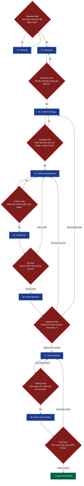

# Studio 1 Nhà — Full Wedding Photography SEO Content Workflow Pipeline

Workflow sản xuất nội dung chuyên sâu cho **Studio 1 Nhà — Studio Chụp Ảnh Cưới & Cho Thuê Váy Cưới TP.HCM** (studio1nha.com) chuẩn hóa theo kiến trúc FigJam 3 Cấp độ (3-Level Architecture) kết hợp Cổng kiểm soát chất lượng (Gates & Feedback Loops).

**Lệnh kích hoạt:** `/flow-studio1nha-seo [keyword chính] [keyword phụ 1] [keyword phụ 2] ...`

---

## 1. LEVEL 1: HIGH-LEVEL WORKFLOW (WHAT) — 8 ĐẦU VIỆC LỚN

Sơ đồ luồng tổng thể 8 Workstreams và đầu ra tương ứng:

---

## 2. GATES & FEEDBACK LOOPS (CỔNG KIỂM SOÁT CHẤT LƯỢNG)

---

## 3. LEVEL 2: LOW-LEVEL WORKFLOW (HOW) — CHI TIẾT TỪNG ĐẦU VIỆC

### 01. PLANNING
*   **1.1 Xác định chủ đề**: Concept chụp ảnh cưới tại Studio (Hàn Quốc nhẹ nhàng, Châu Âu sang trọng, Vintage), Concept ngoại cảnh (Đà Lạt, Hồ Cốc, Phố cổ Sài Gòn), Thuê váy cưới thiết kế, Makeup cô dâu ngày cưới.
*   **1.2 Xác định đối tượng**: Các cặp đôi chuẩn bị kết hôn (22 - 35 tuổi), yêu thích phong cách ảnh cưới tự nhiên, ghi lại cảm xúc chân thật.
*   **1.3 Output**: Lưu `Planning context` trong `research.md` tại `clients/Studio1Nha/brands/Studio1Nha/keywords/[keyword-slug]/`.

### 02. RESEARCH
*   **2.1 Search Intent**: Tìm kiếm ý tưởng concept ảnh cưới, kinh nghiệm chọn váy cưới hợp dáng người, bảng giá chụp ảnh cưới trọn gói không phát sinh, bí quyết tạo dáng tự nhiên trước ống kính.
*   **2.2 Keyword Expansion**: Trích xuất từ khóa visual (tone màu ấm, ánh sáng tự nhiên, góc máy điện ảnh, váy cưới đuôi cá, váy cưới chữ A ren Pháp).
*   **2.3 Competitor Intelligence**: Cào live DOM Top 3-5 studio đối thủ qua `browser tool`.
*   **2.4 Output**: `Keyword Strategy Table` & `Competitor Analysis Table`.

### 03. CONTENT STRATEGY
*   **3.1 Content Gap**: Khắc phục các bài viết đối thủ chỉ đưa hình ảnh quảng cáo chung chung mà thiếu hướng dẫn chi tiết cách chuẩn bị tâm lý, phụ kiện và lịch trình buổi chụp.
*   **3.2 Studio 1 Nhà USP**: Bắt trọn khoảnh khắc tự nhiên không gượng ép, cam kết toàn bộ file gốc chất lượng cao, giá trọn gói minh bạch.
*   **3.3 Output**: Phần `Content strategy` trong `research.md`.

### 04. OUTLINE DEVELOPMENT
*   **4.1 Cấu trúc chuẩn 5-6 H2**:
    1. Ý nghĩa & Xu hướng concept chụp ảnh cưới đang được yêu thích nhất.
    2. Chi tiết ý tưởng concept & Gợi ý trang phục/phụ kiện phù hợp.
    3. Hướng dẫn cách tạo dáng tự nhiên & Bí quyết chụp ảnh cưới không bị đơ.
    4. Bảng giá gói chụp ảnh cưới trọn gói & Quy trình làm việc từ A-Z.
    5. Studio 1 Nhà — Studio chụp ảnh cưới cảm xúc & váy cưới đẹp tại TP.HCM.
    6. FAQ 5 câu hỏi thường gặp của cô dâu chú rể.
*   **4.2 Output**: `Outline Candidate Table` trong `outline.md`.

### 05. OUTLINE QA
*   **5.1 Wedding Visual QA**: Thẩm định độ chính xác các thuật ngữ nhiếp ảnh cưới, váy cưới và độ hài hòa thẩm mỹ.
*   **5.2 Outline Scoring**: Chấm điểm outline ($\ge 80$).
*   **5.3 Output**: `outline-qa-report.md`.

### 06. DUYỆT & KHÓA DÀN Ý (APPROVAL)
*   **6.1 Gửi Creative Team**: Trình duyệt dàn ý với nhóm sáng tạo Studio 1 Nhà.
*   **6.2 Khóa outline**: Lock cấu trúc trước khi viết bài.

### 07. ARTICLE WRITING
*   **7.1 Viết bài Wedding Content**: Triển khai toàn văn bài viết (1600 - 2200 từ) giàu cảm xúc lãng mạn, mang tính chỉ dẫn tận tình.
*   **7.2 Output**: `article.md`.

### 08. ARTICLE QA & PUBLISH
*   **8.1 Fact-check & Publish**: Kiểm tra lại thông tin bảng giá gói chụp và xuất bản lên blog Studio 1 Nhà.

---

## 4. LEVEL 3: EXECUTION (SKILLS, RULES & DATABASES)

### 🛠️ Skills Thực thi
1. `studio1nha-outline-rules`
2. `generating-outlines-studio1nha`
3. `keyword-strategy-mapping` & `keyword-expansion`
4. `competitor-outline-intelligence`
5. `rechecking-facts` & `auditing-content`
6. `outline-quality-scoring` & `client-approval-gate`
7. `writing-semantic-content`

### 🏛️ Foundation & References
*   **Persona**: `data/reference/persona-brand/Studio1Nha/persona-studio1nha-skill.md`
*   **Central Entity**: `data/reference/persona-brand/Studio1Nha/central-entity-Studio1Nha.md`
*   **Source Context**: `data/reference/persona-brand/Studio1Nha/source-context-Studio1Nha.md`
