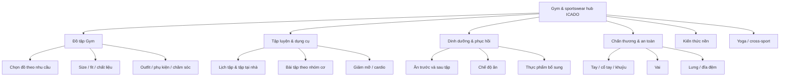

# ICADO Gym Hub — topical map và xử lý trùng search intent

> Phạm vi: toàn bộ danh sách tiêu đề do người dùng cung cấp, thuộc blog ICADO và xoay quanh Gym, Yoga, tập luyện, dinh dưỡng, chấn thương và đồ thể thao.
>
> Phương pháp: phân loại theo **ý định tìm kiếm chính**, không theo từ khóa xuất hiện trong tiêu đề. Mỗi intent chính chỉ nên có một URL dẫn đầu; các bài còn lại phải hợp nhất, đổi góc hoặc chuyển thành phần trong bài trụ cột.

## 1. Kết luận điều hành

- Kho bài đang bị phân mảnh mạnh ở 5 cụm: **đồ tập Gym**, **bài tập giảm mỡ**, **bài tập tay/vai**, **chấn thương khi tập Gym**, **dinh dưỡng Gym**.
- Có một bài trùng tiêu đề hoàn toàn: `9 Tips Siêu Hay Chọn Đồ Tập Gym Nữ Vừa Đẹp Vừa Bền Từ A-Z` xuất hiện 2 lần. Chỉ giữ một URL.
- Nên quy hoạch hub Gym thành 6 nhánh: chọn đồ, dụng cụ/lịch tập, bài tập, dinh dưỡng, chấn thương và kiến thức nền.
- Không nên để ICADO cùng lúc cạnh tranh cho các truy vấn sản phẩm kiểu “top/mẫu nào đẹp” và truy vấn tư vấn kiểu “cách chọn”. Trang ICADO nên ưu tiên tư vấn theo bộ môn, chất liệu, fit, size và athleisure; trang Thegioidotap.vn xử lý PDP, giá và review sản phẩm cụ thể.
- Không xóa bài ngay. Với bài cần bỏ, thực hiện theo thứ tự: chọn URL có traffic/backlink/chuyển đổi tốt làm canonical → hợp nhất nội dung → 301 URL phụ → cập nhật internal link và sitemap.

## 2. Nguyên tắc phân loại và quyết định

### 2.1 Một URL = một intent chính

| Intent chính | Dấu hiệu truy vấn | Dạng trang phù hợp | CTA/đích |
|---|---|---|---|
| Kiến thức nền | là gì, tác dụng, khác nhau | Bài giải thích | Bài liên quan |
| Hướng dẫn thực hành | cách, lịch, bài tập, ăn gì | Guide có quy trình/bảng | Bài chuyên sâu |
| Commercial investigation | nên mặc gì, chọn, phù hợp | Guide chọn sản phẩm theo nhu cầu | `/gym/`, `/yoga/`, collection |
| Comparison | A hay B, khác gì | Bài so sánh độc lập | Collection phù hợp |
| Inspiration | phối đồ, xu hướng, set đồ | Lookbook/outfit | Collection |
| Transactional | mua, shop, giá, sỉ | Category/PDP hoặc B2B landing | Thegioidotap / form sỉ |
| Health/safety | đau, chấn thương, phòng ngừa | Bài an toàn, có giới hạn tư vấn | Khuyến nghị chuyên gia khi cần |

### 2.2 Quy tắc giữ/gộp/đổi hướng

- **Giữ**: intent riêng, có nhu cầu tìm kiếm độc lập, khác đối tượng hoặc khác bộ phận cơ thể/môn tập.
- **Gộp**: cùng một câu hỏi, chỉ khác số lượng, tính từ, năm hoặc cách diễn đạt; giữ bài có dữ liệu tốt nhất.
- **Đổi góc**: cùng chủ đề nhưng có thể tách được intent rõ ràng, ví dụ “cách chọn” khác “phối đồ”, hoặc “nguyên nhân đau vai” khác “bài tập vai”.
- **Chuyển khỏi hub Gym**: bài về Yoga, Pickleball, B2B hoặc sản phẩm cụ thể không nên làm nhiễu topical relevance của Gym.
- **Bỏ khỏi lịch xuất bản/redirect**: bài cũ, tiêu đề năm đã hết giá trị, listicle mỏng hoặc không có intent độc lập. “Bỏ” ở đây là ngừng target độc lập, không phải xóa không kiểm tra.

## 3. Kiến trúc topical map đề xuất

### 3.1 Các trang trụ cột nên có

| Pillar | Intent | URL gợi ý | Bài con chính |
|---|---|---|---|
| Đồ tập Gym nam nữ | Commercial investigation | `/huong-dan-chon-do-tap-gym/` | chọn đồ, size, chất liệu, outfit |
| Tập Gym cho người mới | Informational | `/tap-gym-cho-nguoi-moi/` | lịch tập, tập tại nhà, dụng cụ, thời gian |
| Bài tập Gym theo nhóm cơ | Informational | `/bai-tap-gym-theo-nhom-co/` | tay, vai, ngực, mông, bụng, lưng |
| Giảm mỡ và cardio | Informational | `/bai-tap-giam-mo/` | cardio, nhảy dây, giảm bụng, toàn thân |
| Dinh dưỡng Gym | Informational | `/dinh-duong-cho-nguoi-tap-gym/` | ăn trước/sau tập, chế độ ăn, supplement |
| Chấn thương khi tập Gym | Health/safety | `/chan-thuong-khi-tap-gym/` | tay, cổ tay, khuỷu, vai, lưng |

## 4. Các nhóm trùng search intent cần xử lý

### 4.1 Trùng rất cao — hợp nhất hoặc chỉ giữ một URL

| Nhóm | Bài đang cạnh tranh | Canonical đề xuất | Xử lý các bài còn lại |
|---|---|---|---|
| App tập tại nhà | `15+ App Tập Gym Miễn Phí Tại Nhà Hiệu Quả, Dễ Sử Dụng Nhất`; `15+ Ứng Dụng Tập Yoga, Gym, Thể Dục Miễn Phí Trên Android, iOS` | Giữ bài app đa môn nếu dữ liệu còn mới | Gộp bài app Gym vào bài đa môn; cập nhật theo Android/iOS, không tách theo cách viết |
| Chọn đồ Gym nữ | `9 Tips Chọn Quần Áo Tập Gym Nữ Chuẩn Nhất`; `9 Tips Siêu Hay Chọn Đồ Tập Gym Nữ Vừa Đẹp Vừa Bền Từ A-Z` (xuất hiện 2 lần); `Một Vài Tips Chọn Đồ Bộ Tập Gym Nữ`; `Mách Bạn Các Mẹo Mặc Đồ Tập Gym Nữ Đẹp Nhất` | Giữ bài có URL, traffic và backlink tốt nhất; ưu tiên bài “chọn quần áo Gym nữ” | Gộp toàn bộ thành guide có tiêu chí chất liệu, fit, size, mức hỗ trợ và môn tập; 301 bản trùng |
| Đồ Gym nữ: set/mẫu/đẹp | `5 Bộ Đồ Tập Gym Nữ Màu Pastel Thời Thượng`; `Top 10 Set Đồ Tập Gym Nữ ICADO Hot Nhất Năm 2024`; `Top Những Mẫu Quần Tập Gym Nữ Xinh Nhất Năm 2024` | Giữ một lookbook evergreen, bỏ năm trong title | Các bài còn lại thành section/lookbook hoặc redirect; không duy trì nhiều bài “mẫu đẹp” |
| Áo bra Gym nữ | `Lời Khuyên Từ Chuyên Gia Khi Chọn Mua Áo Bra Tập Gym`; `Tất Tần Tật Những Kiểu Bra Tập Gym Đỉnh Cao Tại ICADO`; `Top 7 Mẫu Áo Bra Gym Nữ Phổ Biến Nhất Năm 2024` | Giữ bài “cách chọn áo bra theo cường độ” | Gộp kiểu dáng và top mẫu vào cùng bài; phần sản phẩm cụ thể link collection/PDP |
| Quần đùi Gym nữ | `5 Mẫu Quần Đùi Tập Gym Nữ Mà Nàng Không Thể Bỏ Qua`; `Những Điều Cần Lưu Ý Khi Mua Quần Đùi Gym Nữ` | Giữ bài tiêu chí chọn mua | Gộp danh sách mẫu vào bài canonical; bỏ năm và ngôn ngữ clickbait |
| Áo Gym nam | `7 Kiểu Áo Thun Tập Gym Nam Thoải Mái Và Thời Trang`; `Những Mẫu Áo Tank Top Gym Nam Năng Động Và Lịch Lãm`; `Các Mẫu Áo Khoác Tập Gym ICADO Phong Cách Cho Chàng` | Không gộp mù: tách theo loại áo, nhưng cần một pillar “áo Gym nam” | Đặt 3 bài làm cluster rõ: T-shirt / tank top / jacket; nếu nội dung thực tế chỉ là list sản phẩm thì chuyển về category |
| Quần Gym nam | `Top 5 Kiểu Quần Tập Gym Nam Bán Chạy Nhất 2024`; `Top 6 Mẫu Quần Đùi Tập Gym Nam Hot Nhất Hè 2024`; `Các Mẫu Quần Short Tập Gym Nam Siêu Hợp Cho Cardio` | Giữ guide chọn quần nam theo bài tập | Gộp các listicle; giữ riêng bài cardio chỉ khi có nội dung về độ dài, lớp lót, biên độ vận động |
| Phụ kiện Gym | `Top 8+ Phụ Kiện Tập Gym Không Thể Thiếu Cho Gymer`; `Dụng Cụ Tập Gym Mà Gymer Mới Tập Nên Biết`; `10 Dụng Cụ Tập Gym Tại Nhà Đáng Mua Bạn Nên Sở Hữu Ngay`; `Top 3 Mẫu Găng Tay Tập Gym Bền Đẹp Cho Gymer` | Tách “dụng cụ tập tại nhà” và “phụ kiện mang đến phòng Gym” | Bài găng tay là cluster riêng nếu có intent đủ; tránh dùng “dụng cụ” cho cả máy tập và phụ kiện |
| Tập Gym tại nhà | `Bài tập gym đơn giản - 4 Bí quyết khỏe mạnh tại nhà`; `Các bài tập gym hiệu quả tại nhà 2020`; `Tập GYM tại nhà vẫn đạt hiệu quả 100% - Tại sao không?`; `Quần áo gym thích hợp, chất lượng cho người tập tại nhà`; `Thời gian tập gym tại nhà hiệu quả` | Giữ một pillar tập Gym tại nhà; bài quần áo chuyển sang hub đồ tập | Gộp 3 bài kiến thức tập tại nhà; bỏ claim “100%”; bài thời gian chỉ giữ nếu đổi thành section trong lịch tập |
| Lịch/thời gian tập | `Lịch tập gym tại nhà cho người mới hiệu quả nhất`; `Lịch Tập Gym Cho Nam Chi Tiết Từ A -> Z`; `Thời Gian Tập Gym Tốt Nhất: Sáng, Chiều Hay Tối?`; `Thời gian tập gym tại nhà hiệu quả` | Giữ bài lịch tập theo đối tượng; có thể giữ riêng bài thời điểm trong ngày | Hợp nhất hai bài về thời gian tại nhà; bài nam phải có lịch riêng thật sự, không chỉ đổi title |
| Giảm mỡ bụng/toàn thân | `15 Bài Tập Giảm Mỡ Bụng, Giảm Cân...`; `20 Bài Tập Giảm Cân, Giảm Mỡ Bụng...`; `11 Bài Tập Thể Dục Giảm Mỡ Bụng...`; `12 Bài Tập Giảm Mỡ Toàn Thân...`; `4 Bài Tập Cardio Giảm Mỡ Bụng...`; `Nhảy Dây Giảm Mỡ Bụng...`; `Giảm mỡ bụng với 5 tư thế nằm...` | Giữ bài pillar giảm mỡ theo nguyên tắc toàn thân + cardio | Gộp list trùng; tách “nhảy dây” chỉ khi bài có kỹ thuật/lịch riêng; loại claim “giảm 5 kg trong 10 tuần” nếu không có bằng chứng |
| Bài tập tay | `Bài Tập Cho Bắp Tay Thon Gọn...`; `Bài Tập Cơ Tay Tại Nhà...`; `Bài Tập Tay Cho Nữ...`; `Bài Tập Tay Sau...`; `Bài Tập Tay Thon Với Tạ...`; `Bài Tập Tay Trước...`; `Bài Tập Tay Trước Và Sau...`; `Các Bài Tập Tay Với Tạ Đơn...`; `Tập Tay Đúng Cách...`; `Lịch Tập Tay Săn Chắc...` | Giữ pillar tay trước/tay sau theo nhóm cơ; giữ riêng bài nữ nếu intent thực sự khác | Gộp các bài “thon/săn chắc/to khỏe”; bài tạ đơn làm section; lịch 4 tuần chỉ giữ nếu có lịch, volume, ngày nghỉ rõ |
| Bài tập vai | `Bài Tập Cơ Vai Giúp Tăng Kích Thước...`; `Bài Tập Vai An Toàn & Hiệu Quả...`; `Bài Tập Vai Cho Nam...`; `Bài Tập Vai Sau...`; `Bài Tập Vai Tại Nhà...`; `9 Bài Tập Vai Thon Cho Nữ...`; `5 Bài Tập Vai Trước...`; `Các Bài Tập Vai Với Tạ Đơn...`; `Lịch Tập Vai Đẩy & Kéo...`; `Bài Tập Xô Lưng Cầu Vai Tay Trước...` | Giữ guide bài tập vai theo bó cơ: trước, giữa, sau | Gộp các bài “vai hiệu quả/an toàn”; tách nam/nữ chỉ khi khác mục tiêu và chương trình; bài xô-lưng là cluster pull day, không để trong vai |
| Dinh dưỡng Gym | `Chế Độ Ăn Cho Người Tập Gym Đầy Đủ Và Khoa Học 2021`; `Chế độ ăn uống cho người tập Gym CHUẨN 2020`; `Dinh Dưỡng Gym Khoa Học & Đầy Đủ...` | Giữ bài pillar dinh dưỡng, cập nhật không gắn năm | 301 hai bài cũ vào pillar; bổ sung mục tiêu tăng cơ/giảm mỡ, protein, meal timing |
| Ăn trước/sau tập | `Ăn Gì Sau Khi Tập Gym...`; `Ăn gì trước khi tập gym...`; `Tập Gym Buổi Sáng Nên Ăn Gì...` | Giữ riêng “ăn trước” và “ăn sau”; bài buổi sáng là biến thể theo thời điểm | Bài buổi sáng chỉ giữ nếu có lịch ăn trước tập sáng khác biệt; nếu không gộp vào bài ăn trước |
| Supplement | `Thực phẩm bổ sung Tăng Cơ - Giảm mỡ...`; `Thực phẩm chức năng TĂNG CÂN TĂNG CƠ...`; `Thực phẩm chức năng TĂNG CƠ - GIẢM MỠ...` | Giữ bài tổng quan thực phẩm bổ sung, viết lại an toàn | Gộp hai bài “tăng cơ giảm mỡ”; không hứa hẹn tác dụng, cần fact-check y khoa |
| Gym và Yoga | `Gym và Yoga: Sự Kết Hợp Mới...`; `Nên Tập Gym Hay Yoga? Môn Nào Tốt Hơn...`; `Tập Yoga hay Tập Gym: Đề tài gây nhiều tranh luận` | Giữ bài comparison “Gym hay Yoga” | Bài kết hợp chỉ giữ nếu target lịch cross-training khác hẳn; bài trùng còn lại 301 |

### 4.2 Trùng vừa — giữ nhưng phải đổi góc rõ

| Nhóm | Bài liên quan | Cách tách intent |
|---|---|---|
| Chấn thương tay | `Chấn Thương Tay Khi Tập Gym`; `Đau Cổ Tay Khi Tập Gym`; `Chấn Thương Cổ Tay Khi Tập Gym`; `Chấn Thương Khuỷu Tay Khi Tập Gym` | Giữ 3 bài theo vùng: tay tổng quan, cổ tay, khuỷu. Hai bài cổ tay phải hợp nhất; bài tổng quan chỉ làm pillar hoặc redirect |
| Chấn thương vai | `Chấn Thương Vai Khi Tập Gym`; `Đau Khớp Vai Khi Tập Gym`; `Đau Cơ Vai Khi Tập Gym` | Tách “đau cơ sau tập” khỏi “đau khớp/chấn thương”; bài chấn thương vai là pillar. Không dùng “điều trị” như cam kết nếu không có chuyên gia |
| Lưng/đĩa đệm | `Tập Gym Bị Đau Lưng`; `Bài Tập Gym Cho Người Thoát Vị Đĩa Đệm` | Giữ bài đau lưng sau tập ở dạng an toàn; bài thoát vị đĩa đệm là health topic riêng, cần bác sĩ/physio review |
| Khái niệm thể hình | `Gymer Là Gì?`; `Fitness Là Gì?`; `Bodybuilding Là Gì?`; `Cardio Là Gì?` | Giữ 4 bài vì entity khác nhau; liên kết về knowledge hub, tránh viết lặp lịch tập/giảm cân trong từng bài |
| Ngực | `Bài tập ngực dưới`; `Bài Tập Ngực Trên` | Giữ 2 bài cluster; tạo bài pillar ngực nếu có thêm ngực giữa/toàn bộ. Không gộp khi intent truy vấn vùng cơ khác nhau |
| Bóng/dây | `Tập Gym Với Bóng...`; `Bài tập với bóng yoga tại nhà...`; `11 Bài Tập Với Dây Kháng Lực...`; `6 Bài Tập Với Dây Nhảy...`; `Nhảy Dây Đúng Cách...` | Tách bóng Gym, bóng Yoga, dây kháng lực và dây nhảy. Hai bài dây nhảy cần phân biệt “kỹ thuật/tác dụng” và “bài giảm mỡ”, nếu không thì gộp |
| Outfit/athleisure | `Khám phá xu hướng mặc đồ tập gym dạo phố`; `Bạn có nên mặc đồ tập gym đi bơi`; `Hô Biến Áo Tập Gym Thành Áo Đa Năng`; `Bạn có nên mặc đồ tập gym đi bơi` | Giữ athleisure như cluster; bài đi bơi là comparison/care riêng, cần cảnh báo đồ Gym không mặc thay đồ bơi chuyên dụng |
| Chăm sóc đồ | `Giặt quần áo tập gym đúng cách`; `Checklist cách giặt đồ thể thao Gym, Tennis, Pickleball đúng cách` | Giữ một bài chăm sóc đồ thể thao đa môn; nếu cần Gym riêng thì chỉ khác về mùi mồ hôi, không lặp quy trình giặt |

## 5. Bảng xử lý theo trạng thái

### Giữ và nâng thành cluster

- `Cách Chọn Size Áo Tập Gym Nữ Chuẩn Nhất Năm 2024` → bỏ năm, mở rộng thành size theo số đo.
- `Mẹo Chọn Size Áo Tập Gym Nam Chuẩn Nhất Năm 2024` → bỏ năm, giữ riêng nam nếu bảng đo khác.
- `Các yếu tố quan trọng cần lưu ý khi chọn trang phục tập gym` → có thể làm bài tiêu chí nền, nhưng phải tránh trùng bài “cách chọn đồ Gym”.
- `Cẩm Nang Chọn Đồ Tập Gym Cho Năm 2024 Mà Bạn Không Nên Bỏ Qua` → ứng viên pillar; bỏ năm, hợp nhất các bài chọn đồ tổng quát.
- `Đồ Tập Gym Hãng Nào Tốt Nhất Hiện Nay?` và `Đồ Tập Gym Chính Hãng Tốt Nhất Hiện Nay (Phần 2)` → chỉ giữ nếu chuyển thành tiêu chí đánh giá đa thương hiệu; nếu thiên về sản phẩm ICADO, chuyển về category/PDP hoặc gộp thành bài thương hiệu.
- `Review 15+ Thương Hiệu Đồ Tập Gym Nam Tốt Nhất 2024` → có intent review/comparison riêng, nhưng cần dữ liệu cập nhật; bỏ năm và tránh cạnh tranh với bài “hãng nào tốt”.
- `Top 10 Thương Hiệu Đồ Tập Gym Nổi Tiếng Tại Việt Nam` → giữ như bài entity/brand list nếu có tiêu chí minh bạch; gộp với review thương hiệu khi nội dung trùng.
- `Các Mẫu Quần Legging Có Túi Tiện Lợi Khi Tập Gym` và `Những Lưu Ý Quan Trọng Khi Mua Quần Legging Gym Có Túi` → giữ 1 bài “cách chọn legging có túi”, phần mẫu là section.
- `5 Mẹo Nhỏ Giúp Bạn Chọn Bao Tay Tập Gym Bao Chất` và `Top 3 Mẫu Găng Tay Tập Gym Bền Đẹp Cho Gymer` → gộp thành guide chọn găng tay; không target hai bài riêng nếu đều list sản phẩm.

### Hợp nhất/301 sau khi kiểm tra dữ liệu

- Hai bản `9 Tips Siêu Hay Chọn Đồ Tập Gym Nữ Vừa Đẹp Vừa Bền Từ A-Z`.
- `Chấn Thương Cổ Tay Khi Tập Gym` với `Đau Cổ Tay Khi Tập Gym` nếu cùng nội dung và cùng intent.
- Các bài giảm mỡ bụng có format “15/20/11 bài” nếu phần lớn bài tập trùng nhau.
- Ba bài dinh dưỡng/chế độ ăn gắn năm 2020/2021.
- Hai bài comparison Gym–Yoga có cùng kết luận và cấu trúc.
- `Bài Tập Tay Trước Và Sau...` với các bài tay trước/tay sau nếu chỉ là danh sách lặp.
- `Bài Tập Vai An Toàn & Hiệu Quả...` với `Bài Tập Cơ Vai...` nếu không có khác biệt về an toàn/kỹ thuật.

### Nên bỏ target độc lập, không nhất thiết xóa

- Các title gắn năm 2020/2021/2024 nhưng không có dữ liệu mới hoặc không có traffic/backlink.
- Các title dùng claim tuyệt đối: `hiệu quả 100%`, `đánh bay 5kg`, `siêu tốc`, `nhanh nhất` nếu không chứng minh được.
- Các bài chỉ liệt kê mẫu ICADO nhưng không có tư vấn chọn theo chuyển động, chất liệu, size và fit; chuyển thành category/PDP hoặc lookbook.
- `Lấy sỉ quần áo gym ở đâu? Chính sách đại lý chiết khấu cao tại Icado`, `Nguồn hàng gym nữ đẹp...`, `Nguồn sỉ đồ gym nam ICADO...`: không bỏ; chuyển vào **B2B hub riêng**, tránh trộn với D2C Gym hub.
- `Pickleball đồ nữ...`: chuyển sang Pickleball hub, không giữ trong Gym hub.

## 6. Danh sách bài cần ưu tiên audit trước

1. Hai bản trùng hoàn toàn của `9 Tips Siêu Hay Chọn Đồ Tập Gym Nữ...`.
2. Cụm giảm mỡ bụng/toàn thân.
3. Cụm bài tập tay và vai.
4. Cụm dinh dưỡng và thực phẩm bổ sung.
5. Cụm chấn thương cổ tay/vai.
6. Cụm chọn đồ Gym nữ, bra, legging và set đồ.
7. Các bài có năm 2020–2024.

## 7. Quy trình triển khai kỹ thuật

1. Lập bảng URL thực tế, slug, ngày cập nhật, số click/impression, organic sessions, backlink và conversion.
2. Với mỗi nhóm ở trên, chọn canonical dựa trên dữ liệu; không chọn chỉ dựa vào title.
3. Hợp nhất nội dung vào canonical, giữ lại nội dung có giá trị và bổ sung phần còn thiếu.
4. 301 URL phụ về canonical; cập nhật canonical tag, sitemap, breadcrumb và internal links.
5. Với bài không redirect được, dùng `noindex` chỉ khi có lý do rõ ràng; không để nhiều bài mỏng cùng target.
6. Kiểm tra cannibalization lại sau 4–8 tuần bằng Google Search Console.

## 8. Quy tắc internal link

- Pillar trỏ xuống toàn bộ cluster bằng anchor mô tả đúng intent.
- Cluster trỏ ngược về pillar và liên kết ngang khi cùng hành trình, ví dụ `chọn size` ↔ `chất liệu` ↔ `cách giặt`.
- Bài tập chỉ link tự nhiên sang đồ tập, không chèn CTA sản phẩm ở mọi đoạn.
- Bài ICADO về cách chọn/outfit link về collection ICADO; giá, review sản phẩm cụ thể và giao dịch nên link sang `thegioidotap.vn`.
- Bài health/safety không link thương mại quá dày; ưu tiên cảnh báo, nguồn chuyên môn và giới hạn tư vấn.

## 9. Giả định và giới hạn

- Phân tích này dựa trên title/inventory người dùng cung cấp, chưa có URL, nội dung thân bài, dữ liệu GSC, backlink, redirect history hoặc dữ liệu volume.
- Vì vậy, các quyết định “giữ” là **canonical đề xuất**, cần đối chiếu dữ liệu trước khi 301.
- Các claim về giảm cân, điều trị chấn thương, hiệu quả 100% và thông số sản phẩm phải được fact-check trước khi xuất bản.

---
**ICADO - I CAN DO IT**  
Thời trang thể thao chuyên dụng hàng đầu Việt Nam
